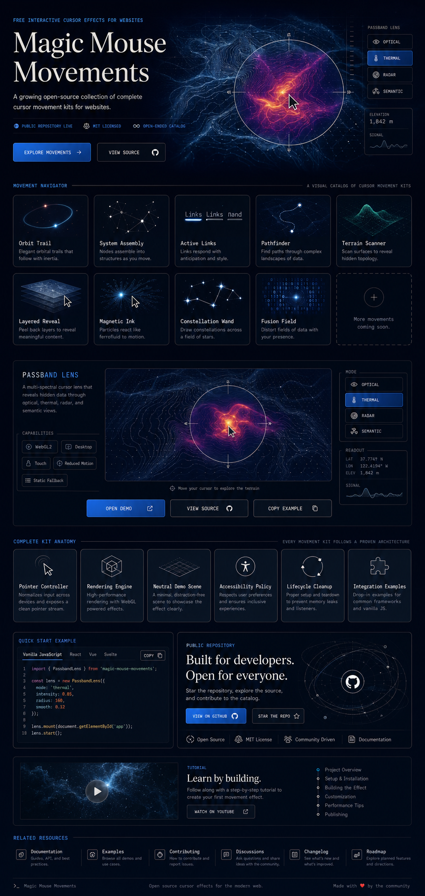
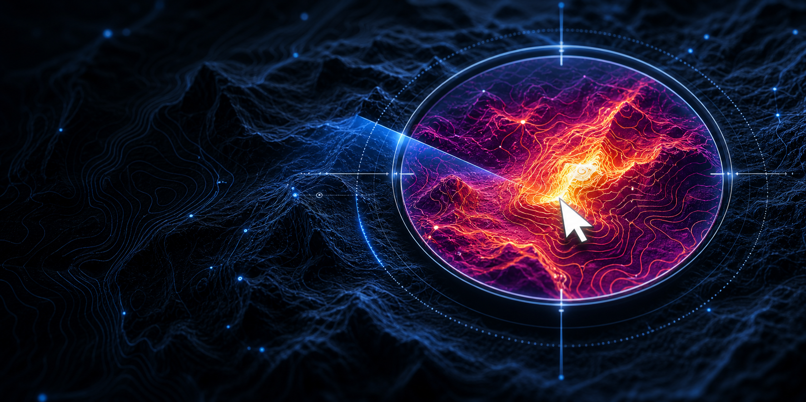
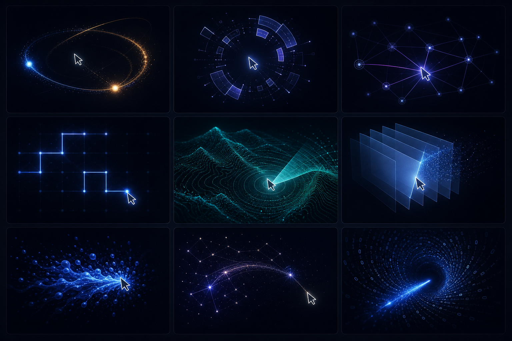

# Magic Mouse Movements

Free interactive cursor effects for websites.

<p align="center">
  
</p>

<p align="center">
  
  
  
  
</p>

Magic Mouse Movements is a growing catalog of complete, customizable interaction kits. Each kit includes the pointer behavior, visual engine, neutral demonstration scene, accessibility policy, lifecycle cleanup, and standalone plus React usage guidance needed to reproduce the effect.

## Principles

- Complete kits, not isolated cursor snippets
- Dependency-free rendering cores
- Native cursor restoration and semantic HTML first
- Fine-pointer enhancement with touch and reduced-motion fallbacks
- One movement mounted and animated at a time
- Neutral assets and clean public provenance

## Visual tour

### Passband Lens

The lead movement renders one terrain field through optical, thermal, radar, and semantic bands. Moving through the field reveals the next sensing band inside the lens.



### A catalog designed to grow

The current kits explore trails, assembly, active links, pathfinding, scanning, layered reveals, magnetic particles, constellations, and binary fields. New movements can join the same manifest and lifecycle without changing the public promise.



These images are conceptual previews. Run the standalone gallery to interact with the real rendering engines.

## Install

```bash
npm install github:abexiong/Magic-Mouse-Movements
```

Import the full catalog or one movement directly:

```ts
import { createPassbandLens } from "magic-mouse-movements/passband-lens"

const movement = createPassbandLens(document.querySelector("[data-passband]"))
movement.start()

// Restore the native cursor and release all resources when the scene unmounts.
movement.destroy()
```

Run the complete local gallery with `npm run demo`.

## Current catalog

| Movement | Technology | Primary behavior |
|---|---|---|
| Passband Lens | WebGL2 | Inspect one terrain through optical, thermal, radar, and semantic bands |
| Orbit Trail | Canvas 2D | Follow a chapter-aware path with orbit telemetry |
| System Assembly | Canvas 2D | Assemble segments around the pointer and nearby domains |
| Active Links | Canvas 2D | Connect the pointer to nearby registered nodes |
| Pathfinder | Canvas 2D | Route orthogonally toward the nearest target |
| Terrain Scanner | Canvas 2D | Reveal procedural contours, points, and scan fronts |
| Layered Reveal | Canvas 2D | Reveal a second visual layer through a moving brush |
| Magnetic Ink | Canvas 2D | Attract particles, write on press, and scatter on reversal |
| Constellation Wand | Canvas 2D | Bend a graph, highlight paths, and select destinations |
| Fusion Field | Canvas 2D | Move through a binary vortex with a comet trail and velocity response |

## Lifecycle

Every kit exposes the same lifecycle:

```ts
const movement = createMovement(container, options)
movement.start()
movement.pause()
movement.resize()
movement.destroy()
```

See each folder under `kits/` for complete usage and customization guidance.
